# Introduction 
Dengue fever has always been observed in Singapore ever since the first outbreak was reported back in 1901. The number of cases has increased significantly over the past few decades and in 2005, the country experienced the worst health crisis since the SARS epidemic which occurred in 2003. The mosquito-borne tropical disease has no proper cure nor vaccine yet.

Ever since Singapore first went into the circuit breaker period on 7th April, the number of COVID-19 confirmed cases have been dropping but on contrary, the number of dengue cases spiked up to the extent that it crossed the 10,000th mark in June. Experts claimed that the surge in dengue cases is an expected result of circuit breaker due to several reasons. Firstly, commercial areas and construction sites have been neglected due to the lack of activities which make perfect spots for Aedes aegypti mosquitoes to breed. Secondly, with more people staying at home, there is a higher risk of dengue transmission in domestic settings.

As of October 2020, a total of 28 people have passed away from dengue fever this year, which is the highest number of fatalities within the past 15 years. As the majority of the fatalities observed in 2020 occurred in the active dengue clusters, we need to focus on the identified cluster areas so that better measures can be implemented for these areas.

# Motivation & Objectives
Our project goal is to study the dengue clusters across Singapore from February 2020 to July 2020, which is inclusive of the circuit breaker period. Our application will allow users to interact within the application to analyse the different geospatial aspects of how dengue spread in Singapore from February 2020 to July 2020. We hope to produce insightful results of how dengue clusters are distributed at specific periods and additionally, we will be exploring how weather changes have contributed to the trend in dengue cases. We hope that the results will be able to assist the relevant authorities in preparing the nation for the more dengue-prone season in the future.

# Related Work
Due to high relevance to our project’s deliverables, we studied one of last year’s IS415 projects which explored the spatial-temporal analysis of dengue transmission in Taiwan using 20 years' worth of data [@taiwanDengue2019].

With the use of 4 functions (Gaussian, Box, Tri and Triweight) of Kernel Density Estimation, our team’s application allows users to identify patterns of dengue clusters by adjusting the bandwidth instead of leveraging an adaptive bandwidth.

In their study, they pointed out that it is equally important to analyse the temporal aspects besides looking into the overall cumulative cases in each region. Thus one of the functions allowed users to explore different kernel functions to animate the dengue outbreak distribution, along with other parameters such as regions, density’s sigma and the number of bins.

The team’s project also focused on finding out how dengue spread within Taiwan over time. Exploring their application and the research paper was indeed insightful as their Spatio-temporal analysis showed where and when it stopped and how it spread.

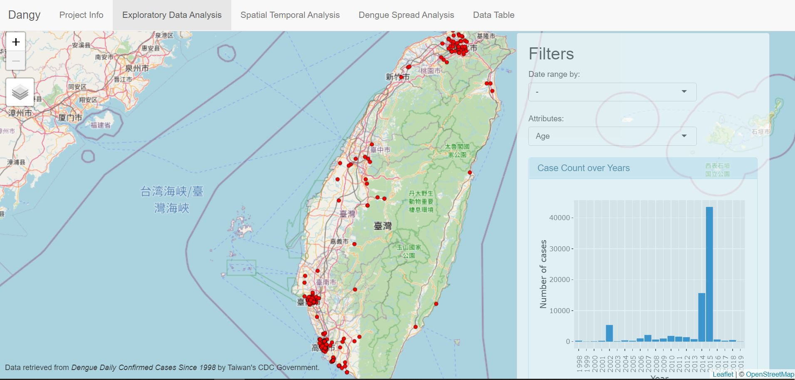

# Methods
This section contains a detailed explanation of the techniques and algorithms we used to address the problem that we identified.

## Data Wrangling
Data Wrangling is a process of data selection and transformation to convert the data into the format that we need for our analysis. The following sections describe the Data Wrangling that we performed.

### Standardize Coordinate Reference System (CRS)
For the raw dengue cases dataset that is in CSV format, we first converted the latitude and longitude coordinates to geometry points using the st_as_sf function of the sf package. sf::st_transform is then performed to convert the CRS from Geographical Coordinate Systems WGS84 EPSG 4326 to Projected Coordinate Systems SVY 21 EPSG 3414. 

For all the other datasets that contain geometries, we ensured all the CRS are consistent by using sf::st_transform to transform it to Projected Coordinate Systems SVY 21 EPSG 3414 as well.

### Handling Date Variable
As the date variable is in the String data format, we pre-processed it by using the lubridate package to convert it to a Date variable with %Y-%m-%d format. From the converted date, we created a new date variable that represents the epidemiological week (e-week) instead of referencing back to the week number of the year 2020. This way, our visualizations will be more representative of the period of which dengue outbreak worsened.  

### Handling NA values and Invalid Geometries
Lastly, for all the datasets, we ensured that there are no NA values that could possibly affect our analysis by substituting them with appropriate values. Next, invalid geometries such as "Ring Self-intersection" are also handled by using sf::st_make_valid to make them valid.

## Spatial Point Patterns Analysis
Spatial Point Patterns Analysis is about the study of distribution/spatial arrangements of dengue data points in Singapore to determine if the cases are clustered, random, or uniform. For this analysis, First-order and Second-order Spatial Point Analysis Techniques can be performed.

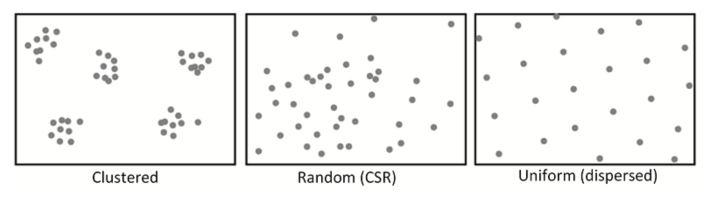

### First-order Analysis
First-order point pattern analysis focuses on the variation in the density of spatial points within a specified study area by leveraging on distance-based measurements. For this project, we explored the option of using Kernel Density Estimation to detect the hotspots of dengue clusters. 

As for the bandwidth, it seemed to be more appropriate to use a fixed bandwidth rather than exploring the option of adaptive bandwidth for the convenience of plotting out the density plots without causing variations in the plots. The bandwidth was fixed at 250m. 

Such analysis can be performed through density-based and distance-based techniques. Density-based techniques include quadrant analysis, and kernel density estimation (KDE) while distance-based technique includes the nearest neighbour index. From the results we will be able to analyse if the dengue cases represent random distribution, uniform distribution, or cluster distribution due to underlying properties, such as the location.

### Second-order Analysis
Second-order analysis looks at the interplay among dengue cases data points to determine any possible relationships. The second order effects are stated as the variations among observations that resulted from the interactions among the dengue case observations. 

Second-order analysis can be performed through techniques such as G function, F function, Ripley’s K function, and L function. 

* G function measures the distribution of the distances between an event to its nearest event
* F function measures the distribution of the distances from a reference point to its nearest event
* K function measures the distribution by constructing a circle radius around each event and calculates the number of other events that fall within the radius. This process is repeated until all points are measured and results are summed. After which, the circle radius is increased incrementally and the process repeated.
* L function is a transformation of K function, whereby the K function is normalised to get a benchmark of zero.

The results of these analysis techniques will be used to analyse if the dengue cases represent random distribution, uniform distribution, or cluster distribution due to interaction effects of the dengue case observations. 

For each of the techniques, Complete Spatial Randomness (CSR) test can be performed where n independent simulation of events is generated. The number of simulations will depend on the confidence interval specified. For example, at 95% confidence interval, there will be 40 simulations. The purpose of performing the CSR test is to determine if the derived results are significant by observing if the observed values fall above, within, or below the simulated confidence envelopes. The interpretation of the output differs for each technique.

## Spatio-temporal Point Pattern Analysis
In addition to looking at the spatial point patterns of the dengue cases in Singapore, we will be looking at the “time” aspect as well. The dengue dataset contains weekly records of dengue case observations over a span of a few months. Having the temporal data could reveal the underlying phenomenon of the spread of dengue over time, that might have been overlooked by solely analysing spatial point patterns. We will be exploring the possible methods of understanding and visualizing the spatio-temporal point patterns through the use of the stpp package. The specific analysis method that we will be applying is the STIKhat function, which computes an estimate of the Space-Time Inhomogeneous K-function.

Using the STIK-function as an unbiased estimator with dataset containing (the locations of events) on a spatio-temporal plane, the equation can be denoted as:

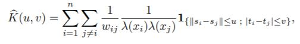

where S is the arbitrary polygon, T as time interval, lambda as intensity & w as the edge correction to study the spatial-temporal edge effect.

## Geographically weighted regression (GWR)

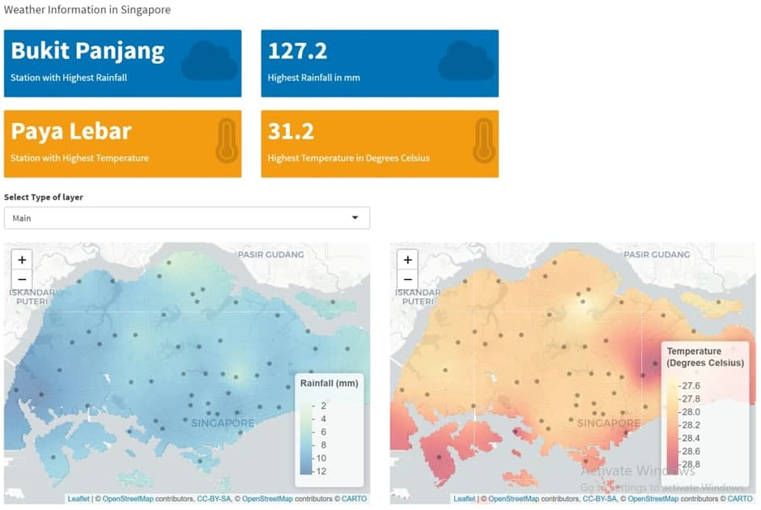

Before carrying out the GWR analysis, we need to work on interpolation of the temperature and rainfall data. For interpolation of weather data, we worked around with the Thiessen polygons which can be created by using the spatstat package [@spatialinterpolation2020].

Before we proceed with the Thiessen polygon, it requires an intersection point with Singapore’s boundary polygon to mark out the areas of interest for interpolation. Hence, we had to confirm the alignment of bbox and proj4string of both objects.

We then moved on to creating empty grids with the existing list of coordinates from the joined data file. Afterwhich, we performed Inverse Distance Weighted Interpolation (IDW) to fill every empty grid with the variable of interest at every subzone location. 
              
Once IDW is completed, the interpolated data is fitted into the 1st order polynomial to be geo-referenced. Although the trend might diminish some movements of the image, it will provide us with a more consistent image to work with.  

Lastly, kriging was performed to reduce the residuals in the data points by computing the 1st order polynomial model into the variogram model which will complete the interpolation of data. This helps to generate a kriged surface which will take into consideration the station locations and fit accordingly to the existing trend.

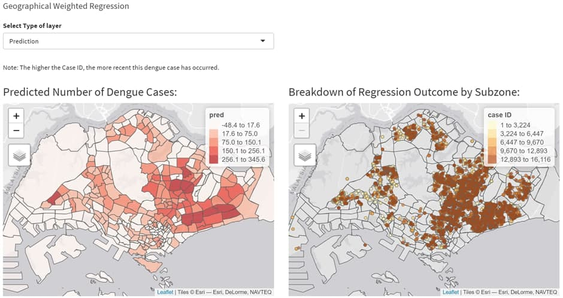

After interpolation was done, we extracted the interpolated values of temperature and rainfall. Together with the use of non-stationary variables like gender, subzone area and housing population types, GWR was then used to model the local relationships between them and the number of dengue cases. We will be using the spgwr package to model the GWR as part of this study. The GWR will be calibrated using the fixed bandwidth method as well as the Gaussian kernel. 

Main outputs of the GWR used for our analyses are: 

* Predicted Number of Dengue
* Coefficient of Standard error of the prediction which measures the reliability of each estimate. As the standard error of the estimates gets smaller, the confidence in that value would become higher. Thus, we can avoid local collinearity.
* Local R2 values which measure how well the GWR predicts the number of dengue cases in each subzone to provide more information about variables that may be missing from the model.

# Application System Architecture
The following diagram is the overview of our system architecture.

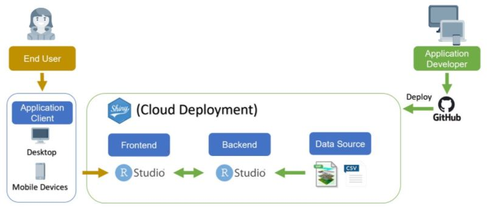

# Results
How the geospatial analytics tool developed help to discover new
understanding from the data.

## First-order Point Patterns Analysis
### 21 e-week

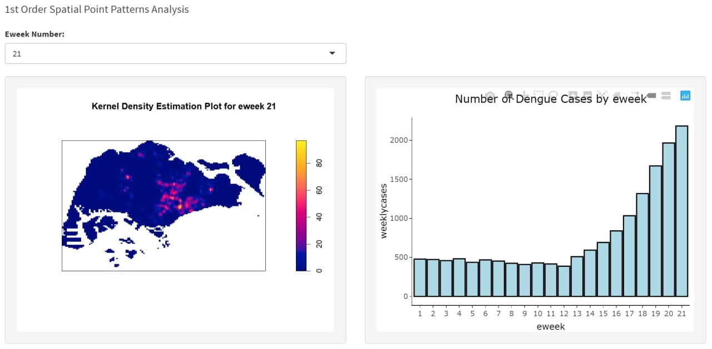

Based on both the number of dengue cases by e-week and by month, we can observe a sharp increase after the start of circuit breaker was announced.

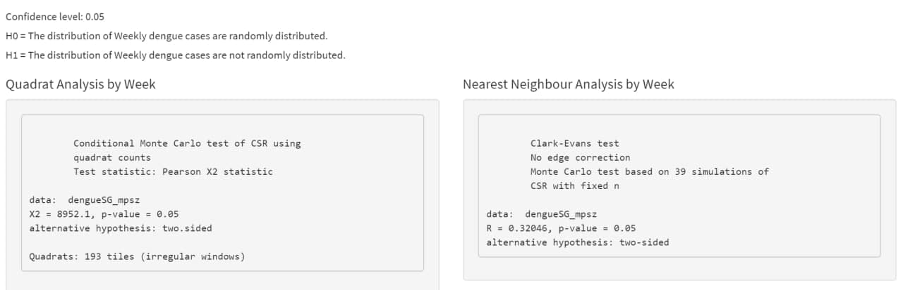

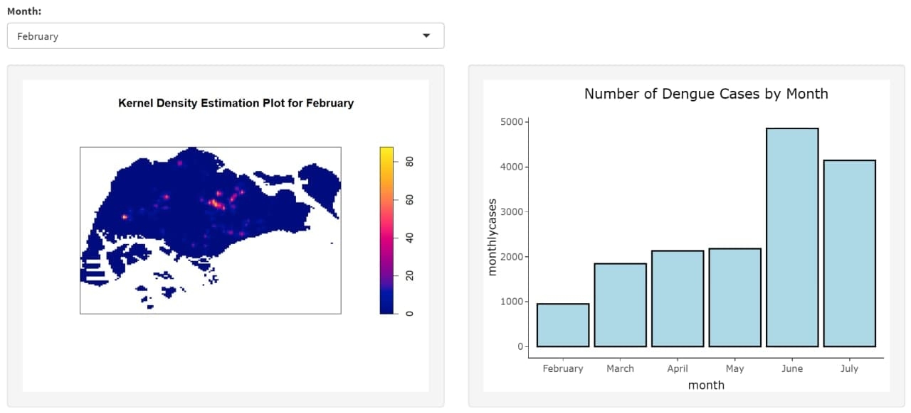

Additionally, from the kernel density plot by e-week and month, we can tell that the density of the number of dengue cases become more intense as time passes. The sharp increase in the density is mostly observed in the Central and East regions of Singapore as predicted in our GWR as well. 

Additionally, the Quadrat Analysis & Nearest neighbour Analysis of both weekly and month plots have all yielded p-value of 0.05. And we can reject the null hypothesis that the data points are not randomly distributed. 

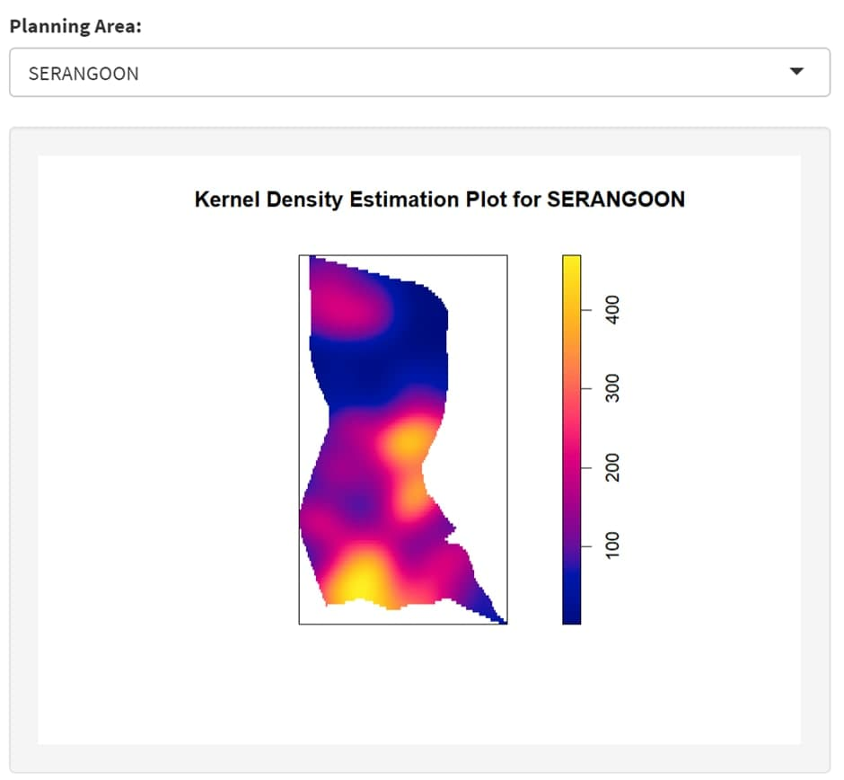

Lastly, by viewing the KDE plot of the historical data for each Planning Area, the most recent dengue cluster was at Serangoon as well. Hence, we can conclude that the dengue cases are mostly clustered around the Central & East region of Singapore where the center of the cluster is Serangoon.

## Second-order Point Patterns Analysis
### Study Area: Serangoon in e-week 21

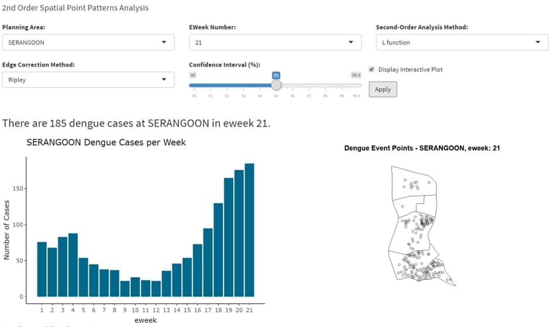

After conducting the First-order Point Patterns analysis, we proceed with the Second-order. The image above displays the available options to perform Second-order analysis. For this section, we will be analyzing the dengue cases at Serangoon in e-week 21 through the use of the G function, F function, K function, and L function analysis techniques.

For each of the analysis, the following hypothesis statements are tested:

* Null hypothesis (H0) = The distribution of dengue cases at SERANGOON in e-week 21 is randomly distributed.
* Alternative hypothesis (H1) = The distribution of dengue cases at SERANGOON in e-week 21 is not randomly distributed.
* We set the confidence interval to be 95%, the null hypothesis will be rejected if the p-value is smaller than the alpha value of 0.05. 
* At a 95% confidence interval, the Monte Carlo Complete Spatial Randomness (CSR) simulation test is set to 40 simulations.

#### G function

The plot above shows the output of the G function CSR test. The theoretical values are represented by the red dotted line, the observed G values are represented by the black line, and the confidence envelope (95%) is represented by the grey area. 

* Clustered pattern is defined as the observed values being above the confidence envelopes. 
* Regular pattern is defined as the observed values being below the confidence envelopes.
* Complete Spatial Randomness pattern is determined when the observed values fall within the confidence envelopes.

The point pattern of the dengue cases largely lies above the envelope and resembles clustering up till the distance of about 220m, hence spatial clustering is statistically significant and we reject the null hypothesis (H0).

#### F function

The plot above shows the output of the F function CSR test. The theoretical values are represented by the red dotted line, the observed F values are represented by the black line, and the confidence envelope (95%) is represented by the grey area. 

* Clustered pattern is defined as the observed values being under the confidence envelopes. 
* Regular pattern is defined as the observed values being above the confidence envelopes.
* Complete Spatial Randomness pattern is determined when the observed values fall within the confidence envelopes.

The point pattern of the dengue cases largely lies below the envelope and resembles clustering after the distance of about 80m, hence spatial clustering is statistically significant and we reject the null hypothesis (H0).

#### K function

The plot above shows the output of the K function CSR test. The theoretical values are represented by the red dotted line, the observed K values are represented by the black line, and the confidence envelope (95%) is represented by the grey area. 

* Clustered pattern is defined as the observed values being above the confidence envelopes. 
* Regular pattern is defined as the observed values being below the confidence envelopes.
* Complete Spatial Randomness pattern is determined when the observed values fall within the confidence envelopes.

The point pattern of the dengue cases largely lies above the envelope and resembles clustering throughout, hence spatial clustering is statistically significant and we reject the null hypothesis (H0).

#### L function

The plot above shows the output of the L function CSR test. The theoretical values are represented by the red dotted line, the observed L values are represented by the black line, and the confidence envelope (95%) is represented by the grey area. As the L function is a transformation of the K function, the interpretation is similar.

* Clustered pattern is defined as the observed values being above the confidence envelopes. 
* Regular pattern is defined as the observed values being below the confidence envelopes.
* Complete Spatial Randomness pattern is determined when the observed values fall within the confidence envelopes.

The point pattern of the dengue cases largely lies above the envelope and resembles clustering throughout, hence spatial clustering is statistically significant and we reject the null hypothesis (H0).

After analyzing the dengue cases at Serangoon in e-week 21 through the 4 analysis techniques, it is evident that the dengue cases resemble statistically significant spatial clustering patterns.

## Spatio-temporal Point Pattern Analysis

### EDA of Dengue Cases at Serangoon in e-weeks 12 to 21

The next analysis that we would like to perform is to analyse the spread of dengue cases in Serangoon across time, for the past 10 e-weeks from e-weeks 12 to 21. We first visualize the dengue data points that we are working on.

The image above shows the available controls to perform exploratory data analysis on the dengue cases which can be filtered by the Planning Area and the range of e-weeks. Looking at the cumulative figures of dengue cases across the weeks, we can see that there is a surge in the number of dengue cases per week as the weeks go by, with e-week 21 showing the highest number of cases.

Similarly, looking at the space mark plot on the right, e-week 21 has the largest increase in the number of dengue cases among these 10 weeks.

Lastly, looking at the 3-Dimensional plot, the majority of the dengue cases appear to be occurring within the same area, with a few new points at other parts of Serangoon as the e-weeks increase. This shows that apart from the hotspot areas, there is indeed a spread of dengue cases appearing in other areas as well. 

### Analysis of Dengue Cases at Serangoon in e-weeks 12 to 21

After exploring the Spatio-temporal data, we proceed to conduct the estimation of the Space-Time Inhomogeneous K-function (STIKhat) to analyse the data. All three plots above visualize the STIKhat results that were calculated based on the dengue cases at Serangoon in e-weeks 12 to 21. The differences between the plots are the types of visualization; from left to right, the plots are visualized in contour, persp, and image format respectively. Variable “u” represents the distance between the dengue data points in km while variable “v” represents the temporal value in terms of e-weeks. For the plots on the left and the right, variable “u” is plotted along the x-axis and variable “v” is plotted on the y-axis.

According to the stpp documentation, the v value is derived from $$ (Time(max) - Time(min)) / 4$$,  where Time(max) and Time(min) are the maximum and minimum value of the time variable. For our analysis, the maximum v value is 21-12/4 = 2.25 which represents e-week 21, while the minimum v value is 0 which represents e-week 12.

Looking at the plots, if the STIKhat value that is estimated through u and v variable is positive, the dengue cases to be analyzed show signs of clustering. If the STIKhat value is negative, the dengue cases represent a regular distribution. The intensity of the STIKhat value describes the degree of clustering, where a larger value represents a more concentrated cluster. 

When the v value is between 0.75 and 1 (e-weeks 15 and 16), it appears to have a decrease in intensity of STIKhat value. As the value is still positive, it signifies that the clusters formed are less concentrated.

However, if we were to look at the v value when it is between 1 and 1.25 (e-weeks 16 and 17), it implies that there is an increase in intensity, especially when the distance between the dengue cases event points is at its greatest. This suggests that there is a sudden peak of dengue cases at Serangoon during e-week 17 which warrants further investigation to find out the root cause.

Overall, the dengue cases at Serangoon from e-weeks 12 to 21 resemble consistent clusters which fluctuate in terms of concentration between weeks.

## Geographically Weighted Regression (GWR)

The figure above shows two plots - The left plot named “Predicted Number of Dengue Cases” shows predicted dengue outputs based on the historical data from February 2020 to July 2020. On its right, we have “Breakdown of Regression outcome by Subzone” plot which displays all the specific values of every variable which was attributed to the training of the model as well as the predicted dengue output shown on the left plot.

### Predicted Number of Dengue Cases Plot Analysis
The Central and East regions of Singapore are the areas that require more maintenance and regulations. This is because one of the subzones in Serangoon, which is located in the east-central region, has been predicted to experience approximately 342 cases. 

For the GWR model that was implemented for this part of the study, the variables of high significance are as follows:

* Housing Population: HDB 3 room, HDB 5 room, Landed properties, Others 
* Gender: Females, Males 
* Climate: Rainfall, Temperature
* Area demographics: subzone area size

These variables were selected for training the model. As for the ones that were of relatively lower significance, such as HDB 1 & 2 room, Condo and HDB 4 room, were not utilised for the model. 

Another finding that was interesting was the fact that Serangoon subzone with the highest predicted number of dengue cases had a local R-square value of 0.552099, which is on the most likely end as compared to the lower and the upper limit of local R-square which are 0.809 and -0.588 respectively. Moreover, the predicted values for the Serangoon subzone had a coefficient standard error which was more towards the low end considering the fact that the lower and the upper limits are 9.79 and 75,36 respectively. 

### Breakdown of Regression outcome by Subzone Analysis

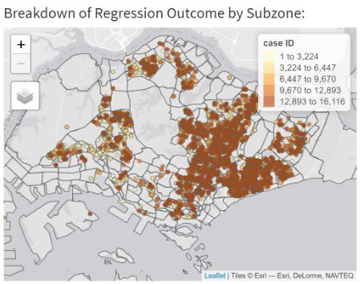

This particular plot allows users to view where the majority of the dengue cases are going towards by observing the case IDs. This can be done as the coordinate points coloured lightly represent the dengue cases that were recorded very long ago, whereas those that are coloured darker represent those that just occurred. 

# Discussion
Our interactive application serves as a platform for the relevant users, such as the National Environment Agency officers, to analyse the dengue cases in Singapore. 

First of all, through our Geographically Weighted Regression (GWR) Analysis page, independent variables such as the housing types, and weather-related variables are used to predict which subzones are likely to have an increase in dengue cases. The projections which are provided as an output of the GWR analysis are visualised onto maps and graphs for users to easily identify the exact locations that are predicted to have a high number of dengue cases. 

For our analysis, we identified Serangoon as the location that is the projected Planning Area to have a surge of dengue cases. With this information, we want to find out possible factors based on historical data.
In order to analyse historical data, our application also allows users to perform Spatial Point Patterns Analysis that includes both the First-Order and Second-Order. The objective of these analyses is to identify if the distribution of dengue cases follows a random distribution, uniform distribution, or cluster distribution due to underlying properties and interaction effects of the dengue case observations. Through the input options provided in our application, we selected the Serangoon planning area as our area of study and e-week 21, which is the latest available dengue cases record available, as the e-week of interest. 
With these filters applied on the dataset, for First-order analysis, we performed Kernel Density Estimation (KDE), Quadrat Analysis and Nearest Neighbour Analysis. Based on the results of these analyses, we conclude at 95% confidence interval that the distribution of dengue cases are not randomly distributed as there are signs of clustering. As for the Second-order analysis, we perform G function, F function, K function, and L function. Similarly, based on the results of these analyses, we conclude at 95% confidence interval that the distribution of dengue cases are not randomly distributed as there are signs of clustering.
In addition to looking at the spatial point patterns of the dengue cases in Serangoon for e-week 21, we looked at the “time” aspect as well by analysing 10 weeks from e-weeks 12 to 21. These temporal data could reveal the underlying phenomenon of the spread of dengue over time, that might have been overlooked by solely analysing spatial point patterns. Through spatio-temporal EDA and STIKhat analysis, we deduced the specific weeks that have sudden spikes or decreases in dengue cases. 

The results of these analyses lay the groundwork for further investigation of the root cause of these fluctuations.

# Future Work
With more research and sourcing of dengue patient demographics, we can perform a more in-depth geographical logistic regression analysis to find out if dengue mosquitos are targeting any specific human demographics. To complement this, we could possibly include an additional feature for the users to upload other relevant data by themselves 

Additionally, if we were to be able to source for better documentation of the stpp package, we would be able to perform a more in-depth spatio-temporal analysis using the Anisotropic Space-Time inhomogeneous K-function (ASTIKhat). The results obtained can be leveraged upon an assumption that Singapore has no mountainous areas and that the majority of its landscape is flat areas. Similarly, we can also use the Estimation of the Space-Time Inhomogeneous Pair Correlation LISTA functions from the stpp package for further studies.

Lastly, a more interesting study could be the applications of deep learning models. Neural Network models have been used in the geospatial sciences since a while back now and it opens up research possibilities such as classification, change detection, function approximation as well as deeper forecasting than non-deep learning models due to the nature of the neurons which takes into account of its Activation & Loss Function. Thus such analysis could provide a more concise and deep understanding of the dataset even further.

# Conclusion
From our research, we found that geospatial interpolation can be very useful as a pre-processing step to geographically weighted regression (GWR) to interpolate raster values which can be extracted to be part of an sf or sp object. Additionally, we were able to rank the significance of the variables used for GWR in the following order from most to least: Housing population types, Gender, Climate & subzone sizes. It was interesting that our analysis has concluded that the human factor plays a huge role in determining the location of the dengue clusters across the different e-weeks during Circuit Breaker in the COVID-19 pandemic. With our predictions on which subzone might have a high surge of dengue cases, recent solutions such as the genetically modified mosquitoes can benefit from this as they would know where to release these breeding of male mosquitos to bring down the female mosquitos and prevent a dengue outbreak [@geneticModifiedMosquitos].
With Spatial-Temporal Analysis, we were also able to track the movement of the data points across all the e-weeks in a multiple dimension plot and open more research possibilities to analyse the outlier points even further. Having to showcase and study this interpretation that our application can generate, we hope that our project will aid researchers or analysts to look into the significant variables of GWR as well as encourage others to create different models to understand the relationship between the dengue cluster outbreak during the Circuit Breaker period with other significant variables.

# References

---
references:

references:

- id: taiwanDengue2019
  title: Spatial-Temporal Analysis for Dengue Transmission in Taiwan 1998-2019
  author:
  - family: Ang
    given: Kah Eng
  - family: Tohvan
    given: Jerry
  - family: Tan
    given: Terence
  URL: 'https://docs.google.com/document/d/1QesrtyHFlFaim2L_UMeWnBZzmPEOZ433VoFlA3tXzJo/edit'
  type: report
  issued:
    year: 2019
    month: 4
- id: spatialinterpolation2020
  title: Spatial Interpolation
  author:
  - family: Gimond
    given: Manuel 
  URL: 'https://mgimond.github.io/Spatial/interpolation-in-r.html'
  type: report
  issued:
    year: 2020
    month: 11
- id: geneticModifiedMosquitos
  title: Aedes mosquito population down 80 per cent in Nee Soon East cluster after release of sterile male mozzies
  author:
  - family: Teh
    given: Cheryl
  URL: 'https://www.straitstimes.com/singapore/aedes-mosquito-population-down-80-per-cent-in-nee-soon-east-cluster'
  type: report
  issued:
    year: 2019
    month: 1
---

